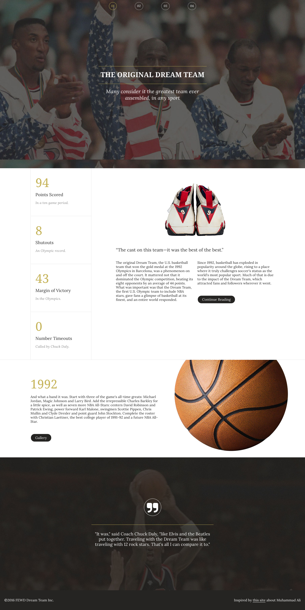

#Dream Team (30 min)

Take a look at the following mockup. 

Choose a Dream Team of 3-4 fellow students and work together to wireframe out what the site should look like when it's responsive.

Start by wireframing a mobile version of the site. If you have time, wireframe a tablet version of the site.

As you wireframe, it may be helpful to consider the following questions:

1. Is there any content that might not be necessary to display on smaller devices?
2. What content needs to be visible?
	- For example, is it necessary to show the entire nav if there are other ways of getting to navigation? 
3. Identify any extra styling.
	- Can we simplify some of the styles a bit for smaller devices, while still maintaining the same look and feel for the site?

Dream Team Basic

Dream Team Challenge

##Finish Early?
Jump into the CSS and start adding media queries